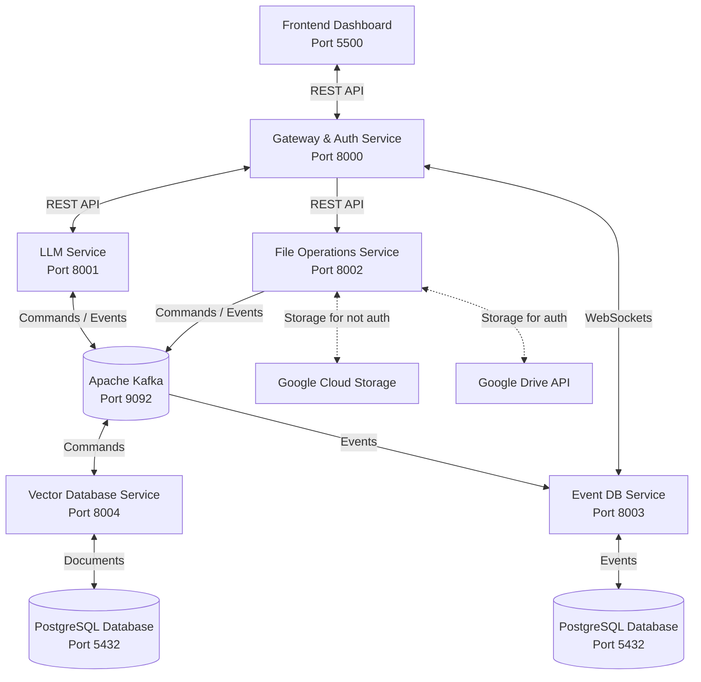

# LLM Semantic File System (Semantic FS)

<p align="center">
  
  
  
  
  
</p>

<p align="center">
  <strong>An Intelligent, Event-Driven Microservices Platform with AI-Powered Semantic Search & Multi-Storage Support</strong>
  <p>Copyright © 2026 Vladislav Buyel. All Rights Reserved.</p>
</p>

---

## Table of Contents

- [What is Semantic FS?](#what-is-semantic-fs)
  - [For End Users](#for-end-users)
  - [For Developers](#for-developers)
- [System Architecture](#system-architecture)
  - [Microservice Architecture Diagram](#microservice-architecture-diagram)
  - [Event-Driven Data Flow](#event-driven-data-flow)
- [Tech Stack & Microservices](#tech-stack--microservices)
- [Quick Start](#quick-start)
  - [Prerequisites](#prerequisites)
  - [1. Clone & Configure](#1-clone--configure)
  - [2. Spin up Services (Convenient Way)](#2-spin-up-services-convenient-way)
  - [3. Spin up Services (Manual Way)](#3-spin-up-services-manual-way)
- [Testing Strategy](#testing-strategy)
  - [The Global pytest Import Conflict](#the-global-pytest-import-conflict)
  - [The Solution: Service-Specific Environments](#the-solution-service-specific-environments)
  - [Running All Tests Sequentially](#running-all-tests-sequentially)
- [Benchmarks](#benchmarks)
  - [Gateway & Load Testing](#gateway--load-testing)
  - [Agent Latency (Langfuse)](#agent-latency-langfuse)
  - [Agent Quality Scores (Langfuse)](#agent-quality-scores-langfuse)
- [API Reference](#api-reference)
  - [Gateway Service (Port 8000)](#gateway-service-port-8000)
  - [LLM Service (Port 8001)](#llm-service-port-8001)
  - [File Operations Service (Port 8002)](#file-operations-service-port-8002)
  - [Vector Database Service (Port 8004)](#vector-database-service-port-8004)
- [Troubleshooting](#troubleshooting)

---

## What is Semantic FS?

**Semantic FS** is an event-driven file management platform that combines standard file operations with AI-powered semantic search. It indexes the actual text in your documents and retrieves files by meaning instead of by exact filename.

### For End Users

- **Search by meaning**: Ask questions like *"Where is my resume?"*, *"Find the tax invoice from last year"*, or *"Show me the Python script that processes data"*.
- **AI assistant experience**: Let the assistant choose whether to search your documents or use the web to answer your query.
- **Unified storage access**: Switch between **Google Cloud Storage (GCS)** and **Google Drive** from one dashboard.
- **Real-time activity view**: Track file uploads, database updates, and event logs as they happen.

### For Developers

- **Decoupled microservice design**: The project is composed of separate FastAPI services, each with its own `requirements.txt` and dedicated virtual environment.
- **Event-driven architecture**: Uses **Apache Kafka** to stream events between services and keep the system responsive.
- **Isolated test environments**: Each service has independent unit and system tests to avoid import conflicts.

---

## System Architecture

### Microservice Architecture Diagram



### Event-Driven Data Flow

1. **File Upload**: The user uploads a file via the UI.
2. **Text Extraction**: The **File Operations Service** (`file_ops`) saves the file, parses its format (PDF, DOCX, TXT, etc.), extracts textual chunks, and publishes an `upload` event to Kafka.
3. **Semantic Indexing**: The **Vector Database Service** (`vector_db`) consumes the event, converts text chunks into 384-dimensional dense vectors using a Sentence Transformer model, and indexes them in **PostgreSQL + pgvector**.
4. **Activity Logging**: The **Event DB Service** (`event_db`) consumes the Kafka event, records it in the PostgreSQL event log, and forwards the log in real-time to the Gateway WebSocket for UI notifications.

---

## Tech Stack & Microservices

| Service Name | Default Port | Primary Responsibilities | Stack / Dependencies |
| :--- | :---: | :--- | :--- |
| **Gateway** | `8000` | User Authentication (Google OAuth 2.0, JWT), API reverse proxying, event relay via WebSockets. | FastAPI, Python-JWT, HTTPX |
| **LLM Service** | `8001` | Tool-calling AI agent, prompt orchestration, Exa-powered web search, and local/remote LLM interface. | FastAPI, OpenAI SDK, Exa API |
| **File Operations** | `8002` | Upload, download, delete, rename, text extraction, and OAuth client integration. | FastAPI, google-cloud-storage, google-api-python-client |
| **Event DB** | `8003` | Persistent storage of system action logs, history search, and real-time WebSocket push. | FastAPI, psycopg (PostgreSQL), AIOKafka |
| **Vector DB** | `8004` | Generating text embeddings, querying cosine distance, indexing text chunks, and pgvector operations. | FastAPI, sentence-transformers, pgvector, psycopg |
| **Kafka Infrastructure** | `9092` | Decoupled event broker. | Apache Kafka (Docker) |

---

## Quick Start

### Prerequisites

Make sure you have the following installed on your system:
- **Docker** and **Docker Compose**
- **Python 3.11 or 3.13+**
- **Node.js** (for simple static server serving the UI)

---

### 1. Clone & Configure

1. Clone this repository to your local system:
   ```bash
   git clone <repository-url>
   cd LLM_Semantic_File_System
   ```
2. Create and populate the root `.env` file:
   ```bash
   cp .env.example .env
   ```
3. Update `.env` with your credentials and local configuration:
   ```env
   # Google OAuth Credentials (from Google Cloud Console)
   GOOGLE_CLIENT_ID=your_google_client_id.apps.googleusercontent.com
   GOOGLE_CLIENT_SECRET=your_google_client_secret

   # JWT Configuration
   JWT_SECRET=your_jwt_signature_secret_key

   # LLM Backend Configuration
   OPENAI_API_KEY=sk-proj-... # Optional if using Ollama
   MODEL=gpt-4o-mini          # or local Ollama model name

   # Web Search API (Optional)
   EXA_API_KEY=your_exa_search_api_key

   # Cloud Storage Buckets
   GCS_BUCKET_NAME=your-gcs-bucket-name

   # PostgreSQL Connection Info (Vector DB & Event DB)
   DOCS_POSTGRESQL_USERNAME=postgres
   DOCS_POSTGRESQL_PASSWORD=postgres
   DOCS_POSTGRESQL_HOST=localhost
   DOCS_POSTGRESQL_PORT=5432
   DOCS_POSTGRESQL_DB=documents
   ```

---

### 2. Spin up Services

If you prefer starting services manually in separate terminals, follow this order:

1. **Start Kafka Docker container**:
   ```bash
   cd src/kafka && docker-compose up -d
   ```
2. **Initialize Kafka topics**:
   ```bash
   # From project root using any service environment
   ./src/file_ops/.venv/bin/python src/kafka/broker.py
   ```
3. **Run individual microservices**:
   - **Gateway (Port 8000)**:
     ```bash
     cd src/gateway_auth && ./.venv/bin/uvicorn v1.main:app --port 8000
     ```
   - **LLM Service (Port 8001)**:
     ```bash
     cd src/llm && ./.venv/bin/uvicorn v1.main:app --port 8001
     ```
   - **File Operations (Port 8002)**:
     ```bash
     cd src/file_ops && ./.venv/bin/uvicorn v1.main:app --port 8002
     ```
   - **Event DB (Port 8003)**:
     ```bash
     cd src/event_db && ./.venv/bin/uvicorn v1.main:app --port 8003
     ```
   - **Vector DB (Port 8004)**:
     ```bash
     cd src/vector_db && ./.venv/bin/uvicorn v1.main:app --port 8004
     ```
4. **Run the static UI Frontend (Port 5500)**:
   ```bash
   cd ui && npx serve -s . -p 5500
   ```

---

## Testing Strategy

### The Global `pytest` Import Conflict

Because each microservice is organized as an independent Python package, running `pytest` from the repo root can cause module resolution conflicts. Shared package names like `domain` and `adapters` may be resolved incorrectly across services.

### The Solution: Service-Specific Execution

Run tests inside each service folder with its own virtual environment. This keeps imports isolated and avoids cross-service naming collisions.

### Running All Tests Sequentially

Use the automation script in the workspace root to run every service suite in sequence:

```bash
./run_tests.sh
```

To run a single service test suite manually:
```bash
cd src/file_ops
./.venv/bin/pytest -v
```

## Benchmarks

The repository includes `benchmarks/load_test.py` for gateway RPS/latency and `benchmarks/run_agent_traces.sh` to replay the 50-case test set against the live agent (with Langfuse tracing).

### Gateway & Load Testing

| Scenario | Gateway-only |
| :--- | :--- |
| Endpoint | `GET /health` |
| Setup | `--concurrency 50 --duration 15` |
| Total requests (n) | 104752 |
| Errors | 0 |
| RPS | 6980.8 |
| p50 latency | 6.85 ms |
| p95 latency | 8.73 ms |
| p99 latency | 16.20 ms |
| Max latency | 48.86 ms |
| Environment | Local |

### Agent Latency (Langfuse)

End-to-end agent turns from `benchmarks/run_agent_traces.sh` (50 queries from `test_cases.json`, `POST /get_response`, model `llama3.2:latest` via Ollama). Percentiles in seconds.

| Observation | p50 | p90 | p95 | p99 |
| :--- | ---: | ---: | ---: | ---: |
| **Trace** `ai-agent-turn` | 8.52 | 14.07 | 18.39 | 34.26 |
| **Generation** `agent-reasoning` (initial) | 2.06 | 2.76 | 3.57 | 14.74 |
| **Generation** `agent-reasoning-followup` | 6.21 | 10.62 | 14.26 | 29.14 |
| **Tool** `call_rag` | 0.08 | 0.11 | 0.15 | 0.22 |

RAG retrieval (`call_rag`) stays sub-second; most wall-clock time is LLM inference across the tool loop.

### Agent Quality Scores (Langfuse)

LLM-as-judge evaluators run on production agent traces in Langfuse (same 50-query benchmark run).

| Evaluator | Scores (n) | Avg | Score 0 | Score 1 |
| :--- | ---: | ---: | ---: | ---: |
| Hallucination | 56 | 0.18 | 42 | 7 |
| Relevance | 56 | 0.83 | 2 | 39 |
| Helpfulness | 48 | 0.78 | 1 | 30 |

Hallucination: lower average is better (0 = grounded, 1 = unsupported claim). Relevance and helpfulness: higher average is better (1 = pass).

---

## API Reference

### Gateway Service (Port 8000)
- `GET /health` — Simple health check.
- `POST /get_response` — Route user queries directly to the LLM service.
- `GET /events/user/{owner}` — Fetch past user logs and system actions.

### LLM Service (Port 8001)
- `GET /health` — Check LLM service health.
- `POST /get_response` — Query tool-calling AI agent.
  - **Payload Structure**:
    ```json
    {
      "text": "What is inside my taxes file?",
      "owner": "user@example.com",
      "correlation_id": "optional-uuid"
    }
    ```

### File Operations Service (Port 8002)
- `GET /health` — Health check.
- `POST /upload` — Upload physical files to Google Cloud Storage or Google Drive.
- `GET /get_all` — Retrieve list of files.
- `DELETE /delete` — Delete file from active storage.
- `PUT /rename` — Rename file in storage.
- `GET /download` — Fetch download link/bytes of file.

> [!NOTE]
> All File Operations API routes require the following headers:
> - `X-Owner`: User Email Address (e.g. `user@example.com`)
> - `X-Auth-Provider`: `google` or `local`
> - `X-Storage-Source`: `gcs` or `drive`

### Vector Database Service (Port 8004)
- `GET /check-file-exists` — Checks whether a file with matching path/size has already been embedded to prevent redundant indexing.

---

## Troubleshooting

### Python Module Mismatch / `ModuleNotFoundError` during `pytest`
- **Cause**: Running `pytest` from the root workspace folder.
- **Solution**: Execute tests via `./run_tests.sh` or navigate to the specific service directory (e.g., `src/file_ops`) and run tests using local virtualenv binaries: `./.venv/bin/pytest -v`.

### `TopicAlreadyExistsError` or Kafka Connection Refused
- **Cause**: Kafka is either not running or the topics are currently being created in the background.
- **Solution**: Run `docker ps` to verify the `llm-semantic-kafka` container is active. If needed, restart it:
  ```bash
  cd src/kafka && docker-compose down && docker-compose up -d
  ```

### `CREATE EXTENSION vector` failure on PostgreSQL startup
- **Cause**: Your local PostgreSQL database does not have the `pgvector` extension installed.
- **Solution**: Run your PostgreSQL database via Docker with `pgvector` built-in, or install it on your OS (e.g., via Homebrew on macOS: `brew install pgvector`).
